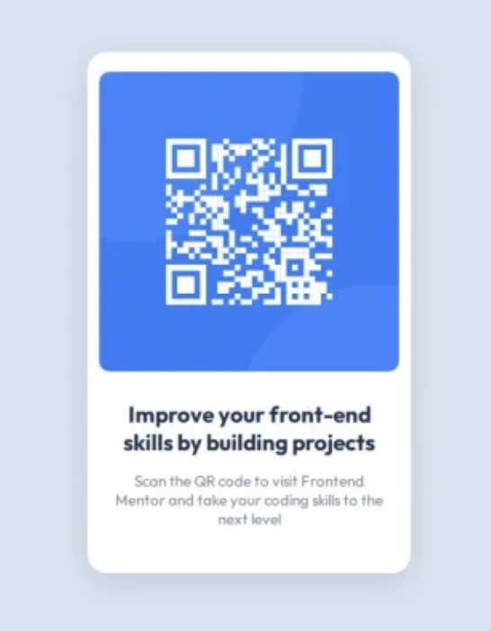

# Frontend Mentor - QR code component solution

This is a solution to the [QR code component challenge on Frontend Mentor](https://www.frontendmentor.io/challenges/qr-code-component-iux_sIO_H). Frontend Mentor challenges help you improve your coding skills by building realistic projects.

## Table of contents

- [Overview](#overview)
  - [Screenshot](#screenshot)
  - [Links](#links)
- [My process](#my-process)
  - [Built with](#built-with)
  - [What I learned](#what-i-learned)
  - [Continued development](#continued-development)
  - [Useful resources](#useful-resources)
- [Author](#author)

## Overview

### Screenshot



### Links

- Solution URL: (https://www.frontendmentor.io/solutions/qr-code-component-using-html-and-css-ly1aKQeqOz)
- Live Site URL: (https://challenge1-qr-code-component.netlify.app/)

## My process

### Built with

- Semantic HTML5 markup
- CSS custom properties
- Responsive and accessibility techniques
- Google fonts (https://fonts.google.com/)

### What I learned

This challenge encouraged me to conduct further research into the very important topics of accessibility and responsiveness. For example, I replaced px unit with rem unit where necessary and used semantic HTML elements, like `main` and `footer`. In addition, I used a CSS reset by Josh Comeau (https://www.joshwcomeau.com/css/custom-css-reset/) to eliminate incosistencies and applied BEM CSS naming convention to make the code easier to read and maintain.

```css
@media (max-width: 375px) {
  div.card {
    margin: 5rem auto;
  }
}

img {
  width: 100%;
}

h1 {
  font-size: 1.4rem;
}
```

### Continued development

After completing this challenge, I will continue learning new techniques on how to make websites responsive and accessible, as well as how to write clean code.

### Useful resources

- [Why font-size must NEVER be in pixels](https://fedmentor.dev/posts/font-size-px/) - This is an amazing article which helped me understand why using rem instead px results in making more accessible websites and it provides an easy-to-understand way to convert pixels to rem.

- [How to write good alt text for screen readers](https://www.craigabbott.co.uk/blog/how-to-write-good-alt-text-for-screen-readers/) - After reading this article, I learned that alt texts need to provide more context.

- [Understanding CSS naming conventions](https://www.frontendmentor.io/articles/understanding-css-naming-conventions-bem-oocss-smacss-and-suit-css-V6ZZUYs1xz) - A useful article by Frontend Mentor explaining the difference between various CSS naming conventions.

- [10 fundamental web accessibility tips for front-end developers](https://www.frontendmentor.io/articles/10-fundamental-web-accessibility-tips-for-frontend-developers-rUurADGxCt#the-importance-of-web-accessibility) - A comprehensive guide on accessibility by Frontend Mentor.

## Author

- Website - [Alexia Veinoglou](https://alexiaveinoglou-myportfolio.netlify.app/)
- GitHub - [LexyVng](https://github.com/LexyVng)
- Frontend Mentor - [@LexyVng](https://www.frontendmentor.io/profile/LexyVng)
- Twitter - [@LexyCodes](https://x.com/LexyCodes)
